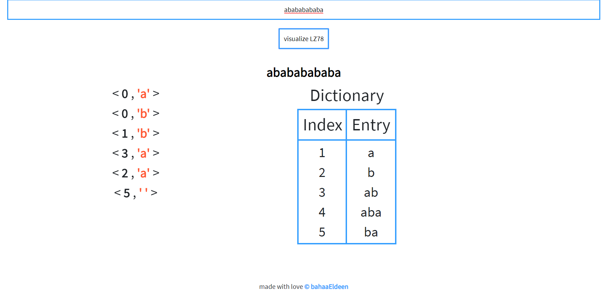

# dictionary-compression-visualizer
visualize dictionary compression algorithms 
currently support LZ78 encoding

Steps to use it: 

1-enter text in the text area above

2-click on visualize button to see encoding in action
1-enter text in the text area above

enjoy your visualizations where you have step by step encoding where red refer to entry seen before and blue for new enteries

final result where you will get the temporary dictionary and the output tags 

