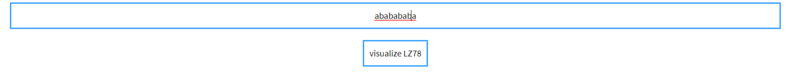

# dictionary-compression-visualizer
visualize dictionary compression algorithms  
link to live website : <a target="_blank">https://dictionary-compression-visualizer.netlify.com/</a> 
currently support LZ78 encoding and decoding

Steps to use it: 

1-enter text in the text area above

2-click on visualize button to see encoding in action

enjoy your visualizations where you have step by step encoding where red refer to entry seen before and blue for new enteries

final result where you will get the temporary dictionary and the output tags 

UPDATE : 
- you can now visualize the decoding process realtime with highlight on the current processing tag and different highlight for processed tags 
- some styles have been changed   
